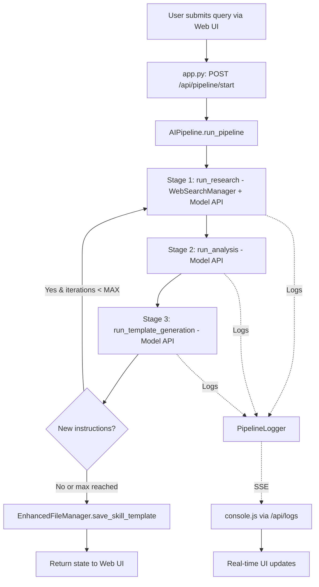
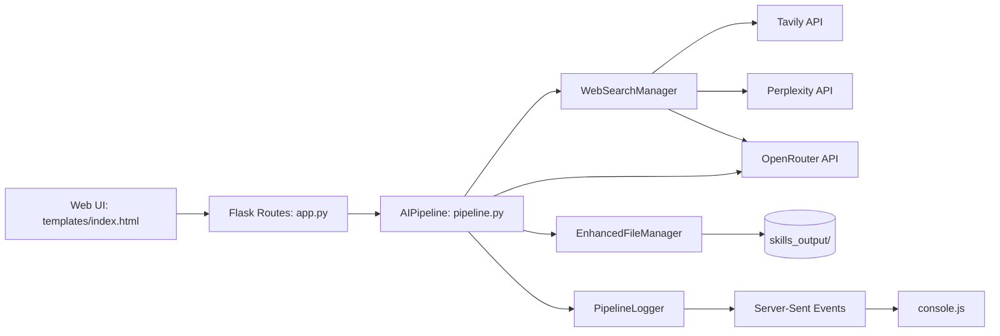

# AGENTS.md
This file provides guidance to Verdent when working with code in this repository.

## Table of Contents
1. Commonly Used Commands
2. High-Level Architecture & Structure
3. Key Rules & Constraints
4. Development Hints

## Commands

### Setup & Dependencies
- `uv sync` - Install dependencies and create virtual environment
- `cp .env.example .env` - Initialize environment configuration (then edit to add OPENROUTER_API_KEY)

### Running Application
- `uv run app.py` - Start Flask development server on http://localhost:5001 (includes hot-reload)

### Testing
- `uv run pytest tests/` - Run all tests
- `uv run pytest tests/test_pipeline.py` - Run specific test file
- `uv run pytest tests/test_pipeline.py::TestAIPipeline::test_call_model` - Run single test

### Code Quality
- `uv run black .` - Format code (line-length: 100)
- `uv run isort .` - Sort imports
- `uv run flake8 .` - Lint code
- `uv run mypy .` - Type checking

## Architecture

### System Overview
An AI Skills Development Pipeline that generates advanced AI agent skill templates through iterative refinement. The system combines multiple AI models via OpenRouter to research, analyze, and create structured YAML-based skill templates with a Flask web UI for interaction.

### Core Pipeline (3-Stage Process)

**Pipeline Flow:**
1. **Research Stage** (`pipeline.py:run_research()`)
   - Model: Grok-4.1-fast (configurable via `config.py:RESEARCH_MODEL`)
   - Queries web search providers for domain information
   - Produces comprehensive background context
   - Output: `skills_output/{TIMESTAMP}/iteration_N/research.md`

2. **Analysis Stage** (`pipeline.py:run_analysis()`)
   - Model: DeepSeek V3.2 (configurable via `config.py:ANALYSIS_MODEL`)
   - Critically evaluates research findings
   - Identifies improvements and gaps
   - May generate instructions for further research
   - Output: `skills_output/{TIMESTAMP}/iteration_N/analysis.md`

3. **Template Generation Stage** (`pipeline.py:run_template_generation()`)
   - Model: DeepSeek V3.2 (configurable via `config.py:TEMPLATE_MODEL`)
   - Creates YAML-structured skill template
   - Includes metadata, instructions, and examples
   - Output: `skills_output/{TIMESTAMP}/iteration_N/template.md`

**Iteration Logic:**
- Maximum of 3 iterations (configurable: `config.py:MAX_ITERATIONS`)
- Repeats stages 1-3 if analysis generates new instructions
- Each iteration stored in separate subdirectory

### Key Components

**Backend:**
- `AIPipeline` (`pipeline.py`) - Main orchestrator; executes 3-stage pipeline, manages state, handles iterations
- `PipelineState` (`pipeline.py`) - Tracks query, timestamp, iteration count, outputs, and history
- `WebSearchManager` (`utils/web_search_manager.py`) - Unified search interface with provider fallback (Tavily → Perplexity → OpenRouter → Direct scraping); results cached for 1 hour
- `EnhancedFileManager` (`utils/file_manager.py`) - Organized storage under `skills_output/` with security sandboxing
- `PipelineLogger` (`utils/logger.py`) - Session-based logging for real-time UI streaming via Server-Sent Events
- `ExportManager` (`utils/export.py`) - Handles ZIP exports of templates and pipeline runs

**Frontend:**
- `main.js` - Pipeline UI, form submission, template listing/preview
- `console.js` - Live log streaming via EventSource (`/api/logs/<session_id>`), displays real-time pipeline progress
- `editor.js` - Template editing and preview functionality

### API Endpoints

**Pipeline Operations:**
- `POST /api/pipeline/start` - Begin new pipeline run (body: `{"query": "..."}`)
- `POST /api/pipeline/iterate` - Execute next iteration (body: `{"session_id": "..."}`)
- `GET /api/logs/<session_id>` - Stream logs via Server-Sent Events (SSE)

**Template Management:**
- `GET /api/templates` - List all generated templates
- `GET /api/template/<timestamp>` - Retrieve template content
- `POST /api/template/<timestamp>/save` - Save edited template (body: `{"content": "..."}`)
- `GET /api/template/<timestamp>/export` - Download template(s) as ZIP (query: `?type=template|full`)
- `DELETE /api/template/<timestamp>` - Delete template and all files

### Data Flow

### Subsystem Relationships

### External Dependencies
- **OpenRouter API** - Required for all model calls (OPENROUTER_API_KEY)
- **Web Search Providers** - Optional but recommended:
  - Tavily API (TAVILY_API_KEY) - Primary search provider
  - Perplexity API (PERPLEXITY_API_KEY) - Fallback search provider
  - OpenRouter search - Secondary fallback
  - Direct scraping - Final fallback (no key required)

### Development Entry Points
- `app.py` - Flask application entry point (contains routes and app initialization)
- `pipeline.py` - Pipeline logic entry point (contains AIPipeline class)
- `config.py` - Configuration and environment variables

## Key Rules & Constraints

### From CLAUDE.md
- Use **UV** for all package management operations (never use pip directly)
- Python 3.8+ required for compatibility
- All model API calls go through OpenRouter; no direct provider access
- Web search fallback priority: Tavily → Perplexity → OpenRouter → Direct scraping
- Pipeline state must be serializable to JSON for storage
- Logs are session-based; each session_id tracks independent pipeline run
- File operations are sandboxed to allowed paths (see `config.py:ALLOWED_READ_PATHS`, `ALLOWED_WRITE_PATHS`)
- Maximum file size for reads/writes: 10MB (configurable: `config.py:MAX_FILE_SIZE_MB`)
- Tests use mocked OpenRouter responses to avoid API costs during testing

### From README.md
- Flask runs on port 5001 by default
- All generated templates stored in `skills_output/` (git-ignored)
- Template directory structure: `YYYY-MM-DD_HH-MM-SS/iteration_N/`
- Each pipeline run creates timestamped directory with metadata.json
- Export supports two modes: `type=template` (final template only) or `type=full` (all iterations)

### Code Style & Quality
- Line length: 100 characters (configured in pyproject.toml)
- Use Black for formatting, isort for import sorting
- Type hints required (mypy strict mode enabled)
- Test coverage required for new features
- No emoji in code or logs unless explicitly designed for UI

### Security Constraints
- Never commit API keys or secrets to repository
- File access is sandboxed via `EnhancedFileManager`
- All file operations logged for security auditing (`EnhancedFileManager.access_log`)
- Path validation prevents directory traversal attacks
- API keys loaded only from environment variables (.env file)

### Configuration Constraints
- `OPENROUTER_API_KEY` is required; application will fail validation without it
- Web search is optional but enhances research quality
- Model configurations can be changed in `config.py` but must be valid OpenRouter model identifiers
- MAX_ITERATIONS=3 prevents infinite loops in iterative refinement

## Development Hints

### Adding a New Model
1. Update model identifier in `config.py` (e.g., `RESEARCH_MODEL = "provider/model-name"`)
2. Verify model is available on OpenRouter
3. Adjust token limits if needed (`MAX_TOKENS_*` constants)
4. Test via Web UI with a simple query
5. Update prompts in `pipeline.py` stage functions if model has special requirements

### Modifying Pipeline Prompts
- Research prompt: `pipeline.py:run_research()` - Controls how domain research is conducted
- Analysis prompt: `pipeline.py:run_analysis()` - Controls critical evaluation and improvement suggestions
- Template prompt: `pipeline.py:run_template_generation()` - Controls YAML template structure and content
- Use specific instructions; models are sensitive to prompt formatting
- Include YAML formatting requirements in template prompt to ensure valid output

### Adding a New Web Search Provider
1. Create provider class in `utils/web_search_manager.py` implementing `search()` method
2. Add provider to `WebSearchManager.providers` dictionary
3. Add configuration validation in `config.py:validate()` if API key required
4. Update priority order in `config.py:WEB_SEARCH_PRIORITY` if needed
5. Provider must return `List[SearchResult]` with title, url, snippet, source, timestamp

### Debugging Pipeline Issues
1. Check browser console for real-time logs (streamed via `/api/logs/<session_id>`)
2. Enable `FLASK_DEBUG=True` in .env for detailed Flask error output
3. Inspect `skills_output/{timestamp}/` directories for partial outputs
4. Check `pipeline.py:call_model()` error handling for API response details
5. Review `EnhancedFileManager.access_log` for file operation issues
6. Use `uv run pytest tests/test_pipeline.py -v` to verify pipeline logic without API calls

### Adding New API Endpoints
1. Define route in `app.py` with appropriate HTTP method decorator
2. Validate request data early (use `request.get_json()` for POST/PUT)
3. Use proper HTTP status codes and error handling (`BadRequest`, `NotFound`, `InternalServerError`)
4. Return JSON responses with consistent structure
5. Update frontend JavaScript (`main.js`, `console.js`, or `editor.js`) to call new endpoint
6. Add corresponding tests in `tests/test_app.py`

### Extending Real-Time Logging
1. Add log calls in pipeline or utility modules: `pipeline_logger.info(session_id, message, stage)`
2. Available log levels: `debug`, `info`, `success`, `warning`, `error` (see `utils/logger.py:LogLevel`)
3. Logs automatically stream to frontend via SSE if session_id matches
4. Frontend `console.js` handles display; update CSS classes in `static/css/style.css` for new log types
5. Session logs auto-expire after 24 hours (configurable: `PipelineLogger.clear_old_sessions()`)

### Working with File Storage
- Always use `EnhancedFileManager` methods, not raw Python file I/O
- Read operations: `file_manager.read_file(path)` - validates against `ALLOWED_READ_PATHS`
- Write operations: `file_manager.write_file(path, content)` - validates against `ALLOWED_WRITE_PATHS`
- All file paths automatically converted to absolute paths for security
- Use `FileManager` static methods for template-specific operations (e.g., `FileManager.load_skill_template(timestamp)`)

### Testing Best Practices
- Mock all external API calls (OpenRouter, Tavily, Perplexity) to avoid costs
- Use `@patch` decorator for mocking (see `tests/test_pipeline.py` examples)
- Test both success and failure cases for API interactions
- Integration tests should verify multi-stage pipeline flow
- Unit tests should isolate individual components (state, file manager, logger)
- Run tests before committing: `uv run pytest tests/ -v`
